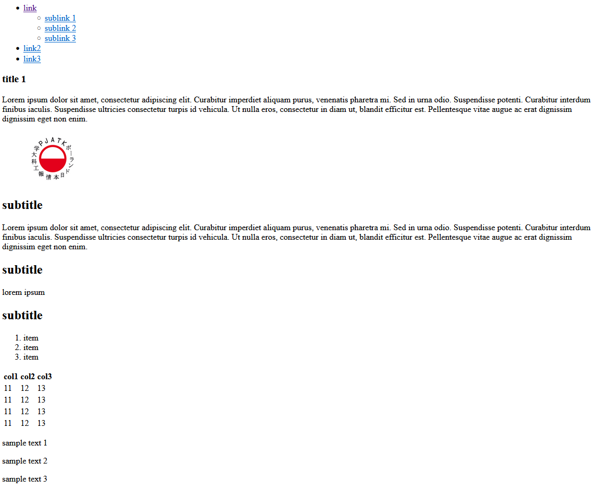

## Laboratorium 1

# HTML

## Teoria

* [Wykład HTML](http://users.pja.edu.pl/~ppisarski/prez/html/1.html)

## Zadania

### 1. Dokument HTML

Stwórz dokument HTML, który będzie wyglądał podobnie jak na poniższym projekcie:

_Strona HTML_

Tekst i obrazek mogą być dowolne. Ważne by w dokumencie HTML znalazły się takie elementy, jak:
* lista linków z zagnieżdżoną pod-listą
* obrazek
* tabelka z wierszem nagłówkowym
* nagłówki i akapity z tekstem
