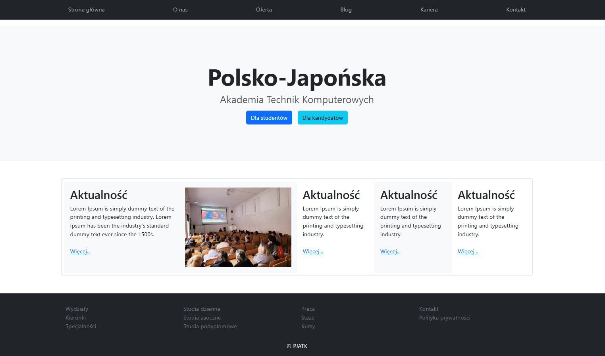
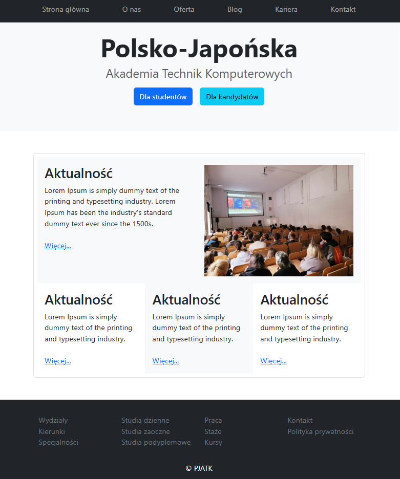
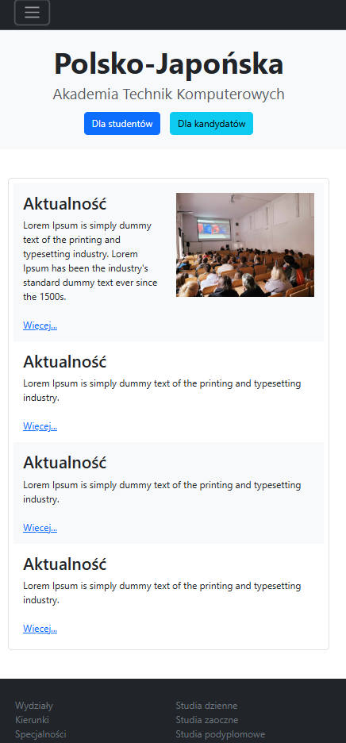
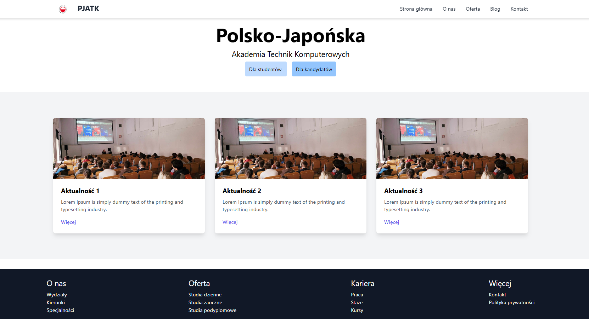
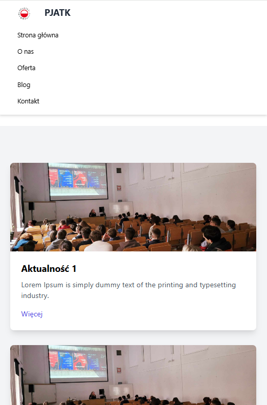
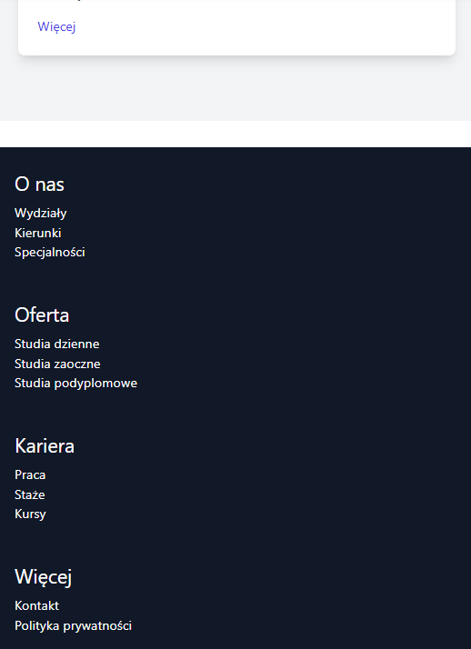

## Laboratorium 4

# Frameworki CSS

## Teoria

* [Wykład Frameworki CSS](https://users.pja.edu.pl/~ppisarski/prez/frameworki/1.html)

## Zadania

### 1. Strona z Bootstrap

Stwórz stronę (tylko strona główna), wyglądającą jak na poniższych zrzutach ekranu. Uwagi:

* Użyj frameworka Bootstrap, wersja 5.
* Nie pisz żadnego swojego kodu CSS, korzystaj tylko z klas Bootstrap'a.
* Zwróć uwagę na wielkość boksów z aktualnościami, zależnie od ekranu.
* Na widoku mobilnym, po kliknięciu w "hamburger", powinno rozwinąć się menu.

_Widok desktopowy (lg)_

_Widok średni (md)_

_Widok mobilny (sm)_

### 2. Strona z Tailwind

Stwórz stronę (tylko strona główna), wyglądającą jak na poniższych zrzutach ekranu. Uwagi:

* Użyj frameworka Tailwind.
* Nie pisz żadnego swojego kodu CSS, korzystaj tylko z klas Tailwind'a.
* Na widoku mobilnym, menu może być na stałe rozwinięte.

_Widok desktopowy (lg)_

_Widok mobilny - góra_

_Widok mobilny - dół_