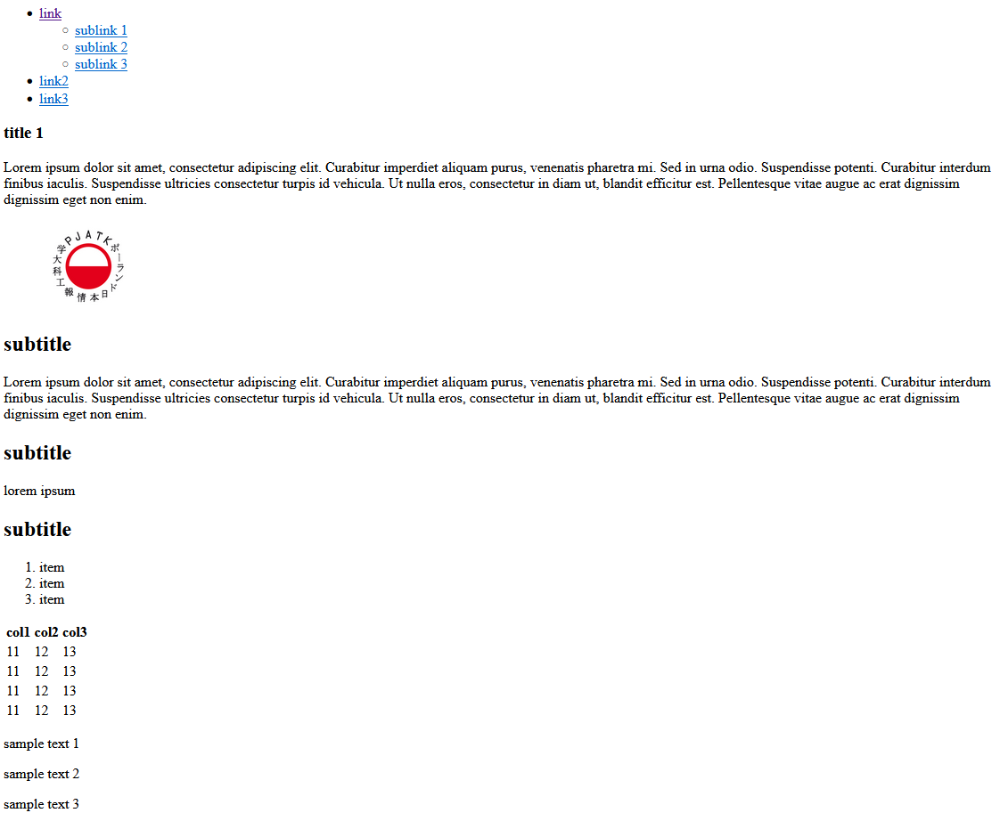
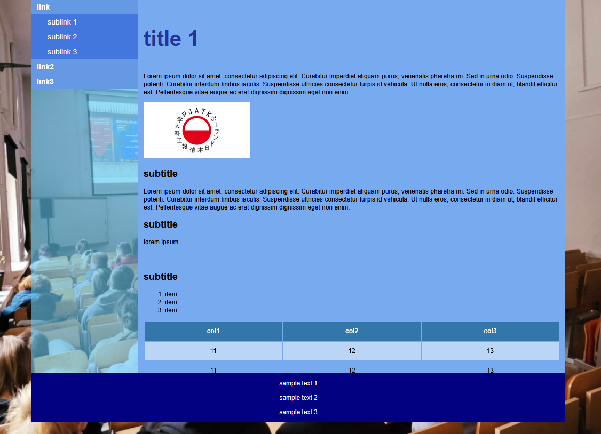
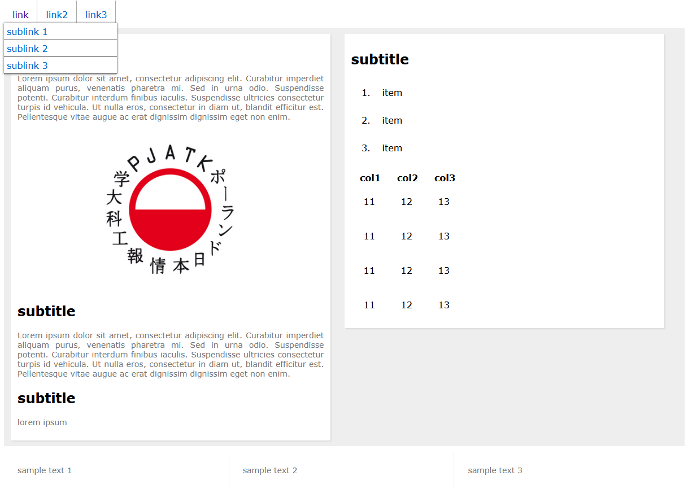

## Laboratorium 1

# Omówienie podstawowych technologii Internetu

## Teoria

* [Wykład HTML](http://users.pja.edu.pl/~ppisarski/prez/html/1.html)
* [Wykład CSS](http://users.pja.edu.pl/~ppisarski/prez/css/1.html)

## Zadania

### 1. Dokument HTML

Stwórz dokument HTML, który będzie wyglądał podobnie jak na poniższym projekcie:

_Strona HTML_

Tekst i obrazek mogą być dowolne. Ważne by w dokumencie HTML znalazły się takie elementy, jak:
* lista linków z zagnieżdżoną pod-listą
* obrazek
* tabelka z wierszem nagłówkowym
* nagłówki i akapity z teksem

### 2. Strona z CSS

Kod HTML z zadania 1 otrzymał style CSS. Wygląda teraz jak poniżej.

_Strona z CSS_

Stwórz style CSS by Twoja strona z poprzedniego zadania wyglądała podobnie. Nie musi być identycznie, ale:
* Treść strony jest scrollowana (tylko prawa kolumna, nie cała strona)
* Strona jest wyśrodkowana
* Lewa kolumna strony jest półprzezroczysta (kolory i obraz w tle - dowolne)
* Stopka jest wyśrodkowana
* Inny kolor na główne linki nawigacyjne, inny na podkategorie
* Linkiem jest cały prostokąt na liście nawigacji, a nie tylko tekst
* Tabelka ma szerokość jak cała kolumna z treścią
* Co drugi wiersz tabelki ma inny kolor

### 3. Strona z CSS - wersja z rozwijanym menu 

Strona www z poprzednich zadań otrzymała nowe style, zgodnie z poniższym rysunkiem:

_Strona z CSS, rozwijane menu_

Stwórz style CSS by Twoja strona wyglądała podobnie. Tym razem ważne elementy to:
* Rozwijane menu: po najechaniu pojawia się lista zakładek należących do danego elementu listy
* Dwie kolumny na treść
* Stopka w trzech kolumnach
* Szerokość kolumn dostosowuje się do szerokości ekranu
* Ten sam kod HTML ma pasować zarówno do nowego stylu, jak i tego z zaadania 2 (do zmiany wyglądu powinna wystarczyć zmiana ścieżki do pliku CSS)!