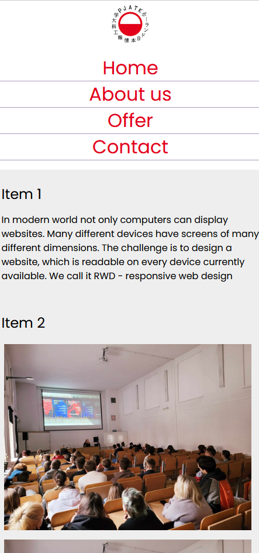

## Laboratorium 2

# Zaawansowany CSS

## Teoria

* [Wykład Zaawansowany CSS](http://users.pja.edu.pl/~ppisarski/prez/new/TIN_Zaawansowany_CSS.pdf)

## Zadania

### 1. Responsywna strona HTML i CSS

Stwórz stronę przy pomocy HTML, by wyglądała tak jak na poniższym projekcie

_Widok desktopowy_

_Widok mobilny - góra i dół strony_

Zdjęcia, teksty i kolory mogą być dowolne. Użyj:
* media queries do stworzenia responsywności (menu nawigacyjne, układ treści i zdjęć);
* flex lub grid – może być przydatny do układu treści;
* czcionki z Google Fonts (w przykładzie jest użyta czcionka Poppins).

Przetestuj stronę zmieniając rozdzielczości na komputerze. Umieść stronę online, np.
na szkolnym serwerze, a następnie przetestuj ją telefonem.

