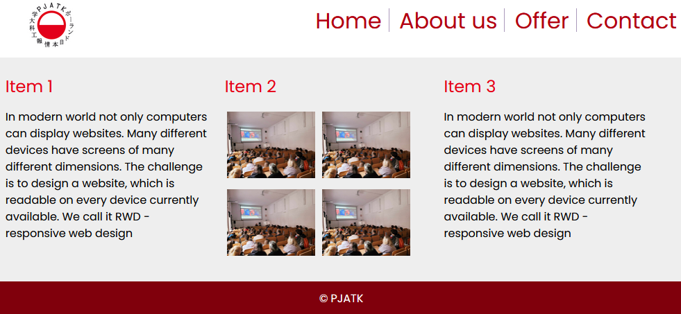

## Laboratorium 3

# Preprocesory CSS

## Teoria

* [Wykład Preprocesory CSS](http://users.pja.edu.pl/~ppisarski/prez/new/TIN_Preprocesory_CSS.pdf)

## Zadania

### 1. Strona www z użyciem LESS

Zadanie przedstawia lekko zmodyfikowaną stronę www z poprzednich zajęć.

_Strona www_

Napisz style do tej strony w technologii LESS:

* Podstawowy kolor zadeklaruj jako zmienną.
* Uzyskaj różne odcienie przy pomocy funkcji kolorystycznych.

Użyj:
* zagnieżdżonych selektorów,
* zagnieżdżonych media query,
* przynajmniej jednego mixina.

Aby skompilować LESS do CSS użyj jednego z poniższych:
* wtyczki do Twojego edytora kodu (dla Visual Studio Code: Easy LESS),
* kompilatora online,
* biblioteki JS kompilującej kod.

### 2. Strona www z użyciem SCSS

Wszystkie powyższe kroki powtórz dla technologii SCSS. Porównaj obie strony, czy wyglągają tak samo.

Wtyczka dla Visual Studio Code: Easy Sass lub Live Sass Compiler.

