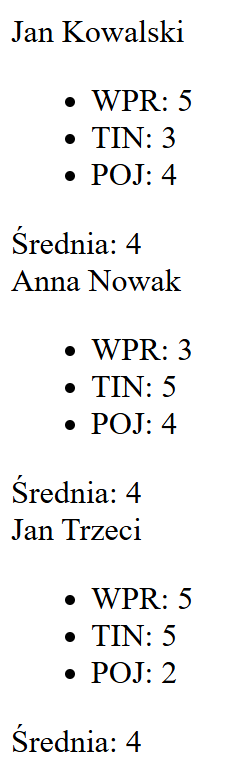
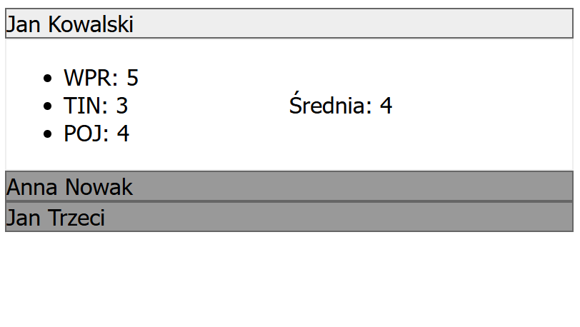

## Laboratorium 8

# DOM

## Teoria

* [Wykład DOM](https://users.pja.edu.pl/~ppisarski/prez/dom/1.html)

## Zadania

### 1. Samochody tabelka

Stwórz tablicę obiektów typu auto (Lab7, zadanie 1).

```
 auto {rok, przebieg, cena_wyjsciowa, cena_koncowa}.
```
Przy pomocy JS zbuduj element DOM – tabelkę zawierającą dane
z tych obiektów. Umieść tabelkę na stronie www przy pomocy JS.

### 2. Studenci - strona z akordeonem

Stwórz tablicę obiektów typu student (Lab7, zadanie 2).

```
 student {
    imie,
    nazwisko,
    srednia,
    oceny //tablica obiektów ocena {przedmiot, wartosc}
 }
```

a) Przy pomocy JS zbuduj elementy DOM, by studenci wyświetlali się na stronie, jak na rysunku.

[](assets/8_1.png) //in progress

b) Dodaj do tego CSS, na przykład taki:

[](assets/8_2.png) //in progress

c) Spraw, by na kliknięcie belki z nazwiskiem, dane studenta zwijały się i rozwijały
* podpowiedź In progress


