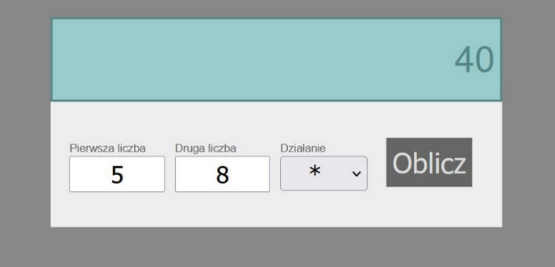

## Laboratorium 9

# DOM - zdarzenia

## Teoria

* [Wykład DOM](https://users.pja.edu.pl/~ppisarski/prez/dom/1.html)

## Zadania

### 1. Prosta modyfikacja DOM. 

Stwórz 4 divy w HTML oraz 4 przyciski. Do przycisków dodaj następujące działanie:
* przycisk 1 – doda kolejny div do 4 istniejących divów
* przycisk 2 – usunie pierwszy div (kolejne naciśnięcie usunie kolejny div i tak dalej)
* przycisk 3 – zmieni kolor tła diva numer 3
* przycisk 4 – wpisze tekst „nowy tekst” do wszystkich divów.

### 2. Kalkulator

Stwórz prosty kalkulator z wykorzystaniem HTML, CSS, JS.
Powinien zawierać:
* dwa inputy na wpisanie liczb,
* wybór działania z listy (dodawanie, odejmowanie, mnożenie, dzielenie) i przycisk uruchamiający liczenie,
* styl CSS na wzór poniższego obrazka
* kod JavaScript przeprowadzający obliczenie i wyświetlający wynik w HTML
* obsługę dzielenia przez zero: komunikat o błędzie.

### 3. Responsywne menu nawigacyjne

Do strony www z zajęć o CSS (np. z Lab2) dodaj responsywność: menu główne na małych ekranach powinno być zwinięte do
„hamburgera” (bez używania gotowych bibliotek). 

[Przykład](https://mobirise.com/bootstrap-menu/bootstrap-navigation-menu-template.html)

Przykładowe kroki:
* element klikalny „hamburger” widoczny tylko na małych rozdzielczościach
* kod JavaScript, który po kliknięciu na hamburger zmienia klasę listy nawigacyjnej
* styl listy nawigacyjnej na małe rozdzielczości (domyślnie niewidoczna, po zmianie klasy – widoczna, zakładki wyświetlają się jedna pod drugą)

### 4. Lightbox

Przy pomocy HTML, CSS, JS zbuduj galerię zdjęć typu Lightbox bez używania gotowych bibliotek.

[Przykład](https://www.cssscript.com/demo/modal-image-gallery-swg/) 

